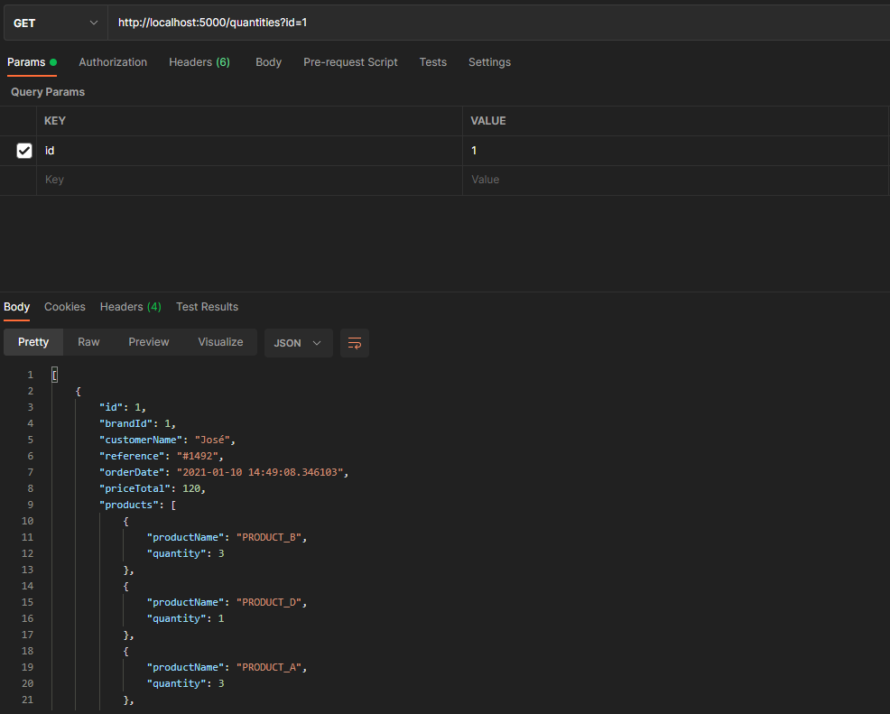

## Getting started

1 hour challenge

Tech:
- .NET Core
- Docker

To run the solution and dependencies, run the following:
- Run `docker build -t supply-chain-api -f Dockerfile .`
- Run `docker-compose up`

Endpoints
- http://localhost:5000/

Example:
- http://localhost:5000/orders?brand=2
- http://localhost:5000/quantities?id=1 

Screenshot

Screenshot
